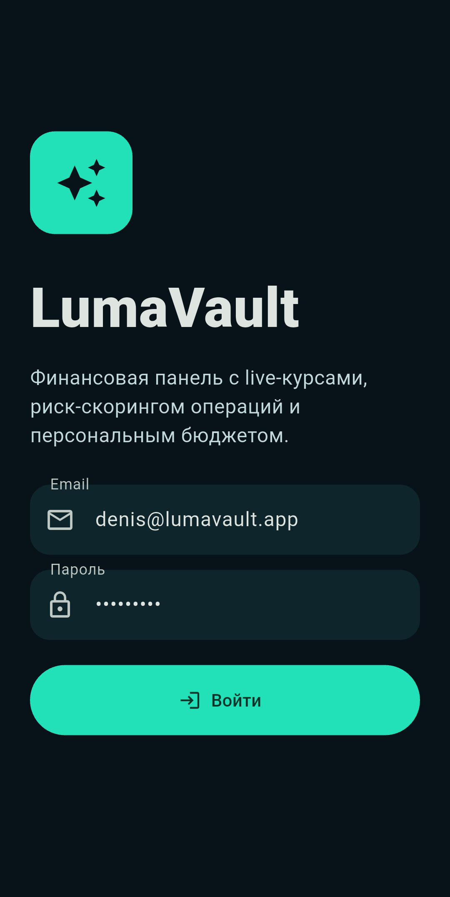
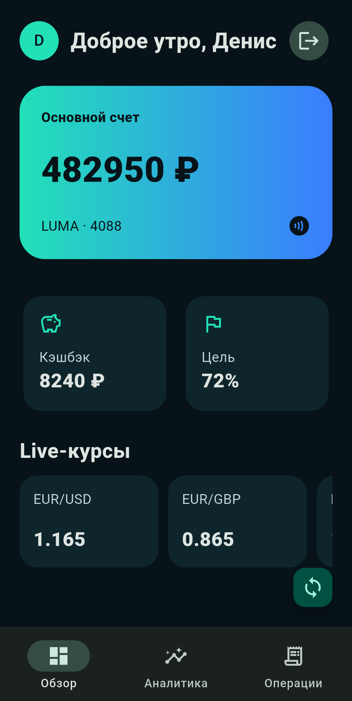
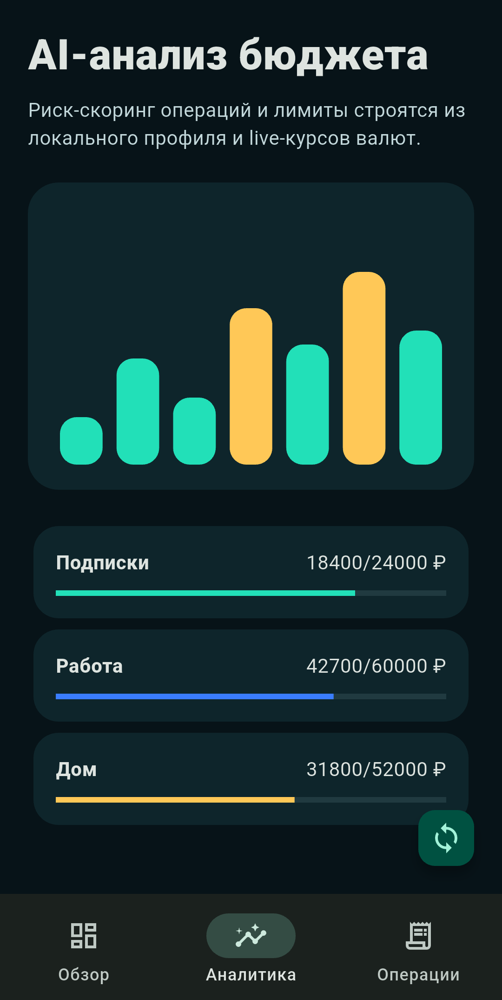
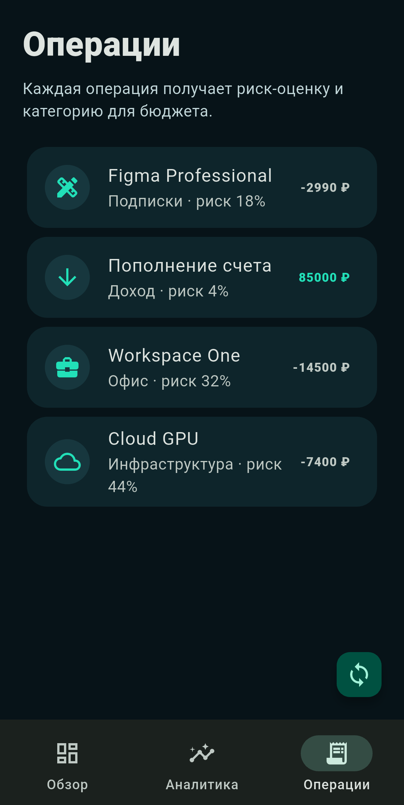

# LumaVault

[English](README.md) | [Русский](README.ru.md)

Портфолио-проект на Flutter в формате финтех-приложения: авторизация, live-курсы валют, аналитика бюджета, риск-скоринг операций и полноценная навигация по разделам.

## Возможности

- Android-приложение на Flutter Material 3
- Авторизация с проверкой email/пароля, сессией, токеном и выходом из аккаунта
- Отдельный repository-слой и API-клиент
- Live-курсы EUR через Frankfurter API с fallback-данными
- AI-style аналитика бюджета, категории трат и риск-скоринг операций
- Smoke-тест виджета и чистый `flutter analyze`
- Брендовая Android-иконка

## Технологии

- Flutter 3.44
- Dart 3.12
- `http`
- Material 3

## Запуск

```bash
flutter pub get
flutter analyze
flutter test
flutter run -d <device-id>
```

## Скриншоты

Скриншоты сделаны на реальном Android-устройстве:

| Авторизация | Дашборд | Аналитика | Операции |
| --- | --- | --- | --- |
|  |  |  |  |

Полный contact sheet: `docs/screenshots/contact_sheet.jpg`.
